### Using SERVA to Install Windows over your Home Network

Have you ever wondered how IT Professionals install Windows on many computers with ease? You might think that they must use CDs or Flash Drives with the Windows installer on it; however, that takes far too much time\. The problem with using a CD or Flash Drive to install Windows is that you can only use it on one computer at a time, and you must carry the CD or Flash Drive around with you — it could get lost\!

IT Professionals install Windows on many computers at once by using the network\. As long as the computer is connected to the network with an ethernet cable, it can download the Windows installer\. Additionally, multiple computers can install Windows at the same time\!

But how do they do this? The bigger businesses and schools use tools like WAIK \(Windows Automated Install Kit\), but if you only want to install Windows on a couple of computers, WAIK is overkill\. Instead, we will use a program called **SERVA** \. This will let you install Windows on a remote computer without any CDs or flash drives\! Let’s get started\!
### **Required Items**
- A computer running Windows, connected to the network, that you will use as the **Host** computer\. This computer will run SERVA and will have the Windows install files on it\.
- The Host computer cannot have a blank password\.
- A computer that you would like to install Windows on, which we will call the **Target** computer\. This computer can be a laptop, but it needs to have an ethernet jack, and be connected to the same network as the Host computer\.
- A Windows install disk or ISO file\.
- A DHCP server on your network — This is most likely running on your Router\. If you can access the internet through your Host computer, then you already have a DHCP server and can ignore this\.

### **Section 1 — On the Host Computer**
#### Step 1 — Install SERVA
1. First, go to the [SERVA download page](http://www.vercot.com/~serva/download.html) and download the right version of SERVA for your system\. Make sure to get the “Community” version\. If you are running on a 64 bit computer, get the 64 bit installer; if you are on a 32 bit computer, get the 32 bit installer\.
2. Extract the downloaded file to a folder you’d like to keep your SERVA program files in\. I chose J:\\SERVA\. You can then make a shortcut to the SERVA executable file if you’d like to keep it on your desktop or taskbar\.
3. Create a folder somewhere easily accessible with no spaces in the path to store your Windows install files in\. For example: J:\\SERVA\_ROOT\.

#### Step 2 — Configure SERVA
1. Open up SERVA\. You will be greeted by a nag message which requires you to wait for a few seconds before you can continue\. Yes, this happens every time\. Just continue when the timer is up\.
2. Click on “Settings\.” If this button isn’t showing up, right click on the icon in the taskbar and click “Settings\.”
3. Click on the TFTP tab and check the box next to “TFTP Server\.”
4. Check the box next to “Bind TFTP to this address,” and make sure that it is the correct IP given to you by your router\. \(Usually looks like 192\.168\.xxx\.xxx\)
5. Under “TFTP Server root directory” click “Browse” and navigate to the SERVA\_ROOT folder you created earlier\. Open the folder, then click “Select\.” Make sure the path shown is correct\.
6. Click on the DHCP tab and check the box next to “proxyDHCP\.”
7. Check the box next to “BINL\.”
8. Check the box next to “Bind DHCP to this address,” and, again, make sure the IP is correct\.
9. Click “OK\.”
10. Close SERVA and re\-open it\. SERVA has to restart to create proper files and such after changing settings\.


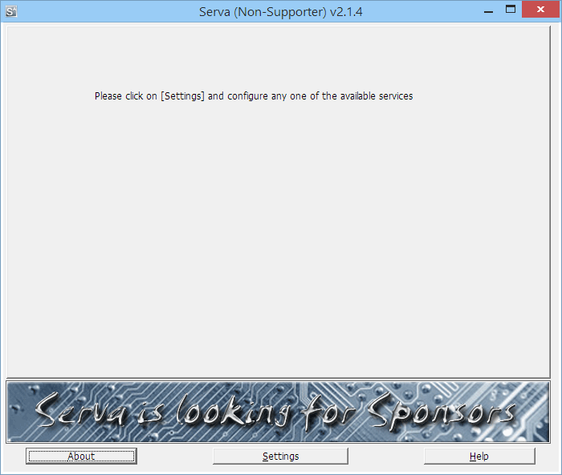


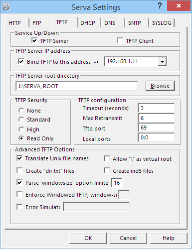


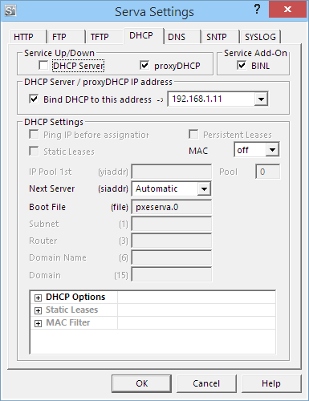

#### Step 3 — Move the Windows Install Files

Open up the SERVA\_ROOT folder you created earlier\. You will see that it is now populated with some folders and files\. Our next step is to move the Windows install files from either a CD or ISO file into the WIA\_WDS folder, where the Target computer will be able to access them\.

**If you have a Windows CD:**
1. Insert the Windows CD into the Host computer\.
2. Create a folder inside SERVA\_ROOT/WIA\_WDS and name it something that describes the Windows install type\. For example: WINDOWS\_8\_x64\.
3. Open “My Computer” or “This PC” if you are on Windows 8, then right\-click on the Windows CD and choose “Open\.”
4. Select all the files inside the CD \(Ctrl \+ A\) and copy them into the new folder you created\.


**If you have a Windows ISO File:**
1. Extract the ISO file into a folder using 7\-zip or another extraction utility\.
2. Copy the extracted folder into SERVA\_ROOT/WIA\_WDS\.
3. Rename the folder to something that describes the Windows install type, with no spaces\. For example: WINDOWS\_8\_x64\.


The new folder you have created should have a structure similar to this:
```
SERVA_ROOT\
    WIA_WDS\
        WINDOWS_8_x64\
            BOOT\
            SOURCES\
            SUPPORT\
            …
```

If everything looks correct, move on to the next step\. If you are lost, post a comment below\!

Note: Windows 7 and 8 install files should be placed in WIA\_WDS\. Windows XP install files should be placed in WIA\_RIS\. Linux install files should be placed in NWA\_PXE\.


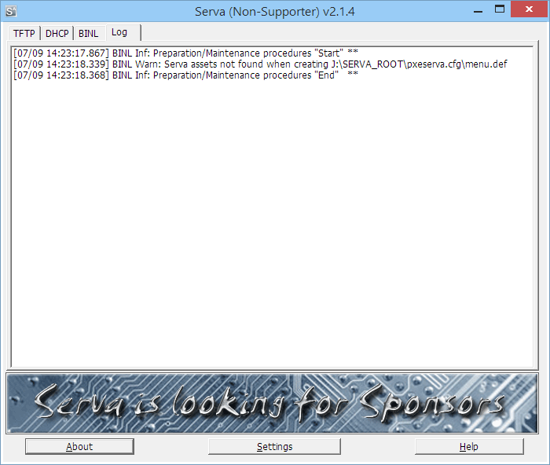


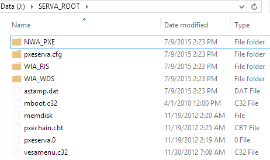


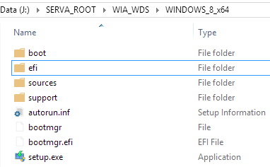

#### Step 4 — Share WIA\_WDS

Now we need to share the WIA\_WDS folder \(or WIA\_RIS/NWA\_PXE if you are installing something other than Windows 7/8\) so that the Target computer can access it\.
1. Right Click on the WIA\_WDS folder\. Click Properties\.
2. Click the “Sharing” tab\.
3. Click “Advanced Sharing…”
4. Check the box next to “Share this Folder\.”
5. Change the Share name from “WIA\_WDS” to “WIA\_WDS\_SHARE”\. This is **required\.** Do not skip this step\.
6. Click “Permissions\.”
7. Make sure that the “Everyone” group is listed, and has only “Read” checked under “Allow\.”
8. Click “OK” on all the dialogs\.


Note: If you are using WIA\_RIS, set the Share name to “WIA\_RIS\_SHARE”\. If you are using NWA\_PXE, set the Share name to “NWA\_PXE\_SHARE”\.


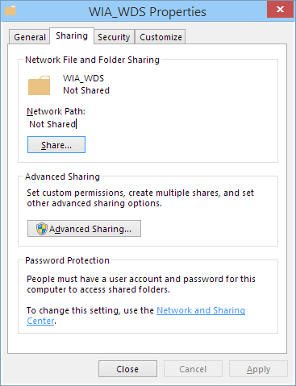


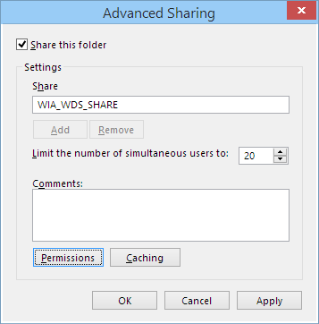


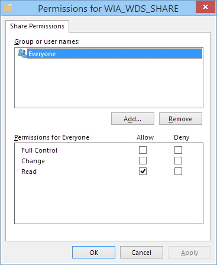

#### Step 5 — Restart SERVA
1. Close SERVA and open it back up\. SERVA will generate the needed files\.
2. Leave SERVA running\.


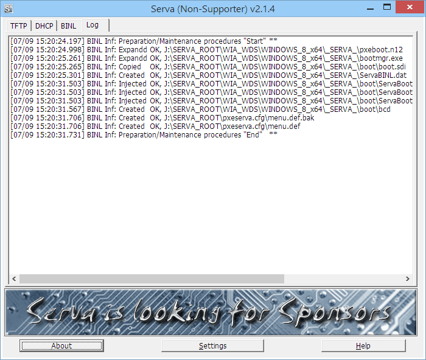


That’s it for the Host computer\!
### **Section 2 — On the Target Computer**
#### Step 6 — Boot from Network
1. On the computer you plan to install Windows on, plug\-in an Ethernet cable from your router\.
2. Start up the computer and either open the Boot Menu and choose the “Boot from LAN” option \(may include the acronym “PXE”\), or if you cannot access the Boot Menu, open the BIOS and change the Boot Order so that “Boot from LAN” is first in the Boot Order, then save changes and reboot\. See the screenshots below for what it looked like on my laptop\.
3. Once your computer boots from LAN, it should automatically connect to SERVA\. If you look at SERVA on the Host computer, you will likely see a lot of new lines appearing\.
4. If everything worked, you will see a list of operating systems you can install\. I only added one operating system to WIA\_WDS, so I only have one option\.
5. Choose the operating system you want to install with the arrow keys, then push enter\. SERVA will begin sending the files for that operating system\.
6. Soon, SERVA will require a username and password\. Use the credentials of the Host computer\. If the host computer runs Windows 8 and your account is a Microsoft account, your username is your Microsoft account email\.
7. Enter the credentials and push “Connect\.” If they were correct, everything will work\! Good job :\)


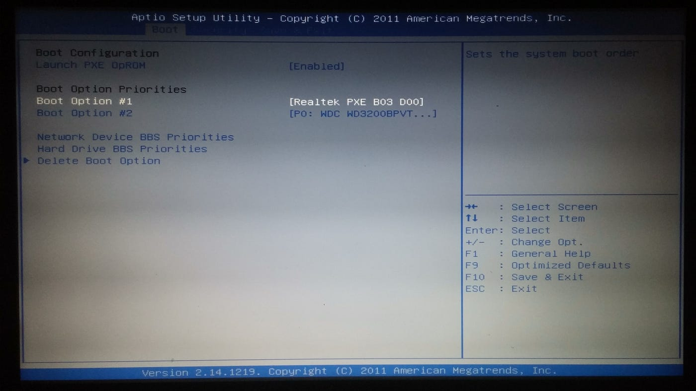


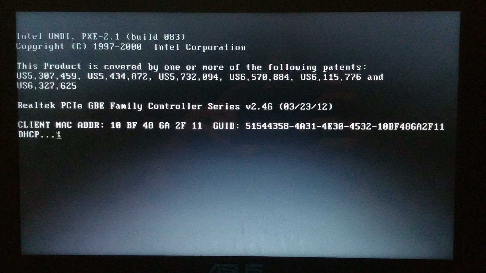


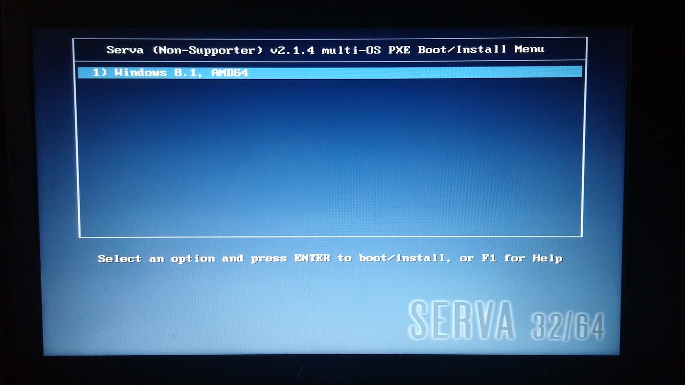


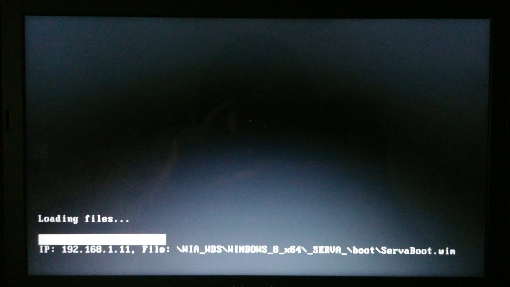


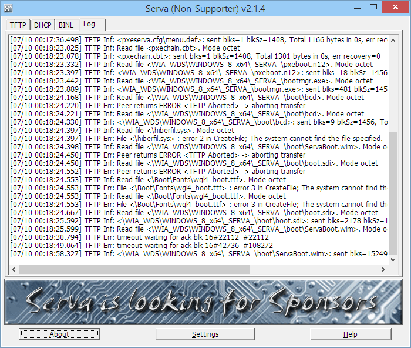


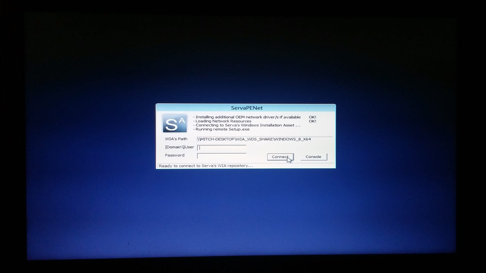


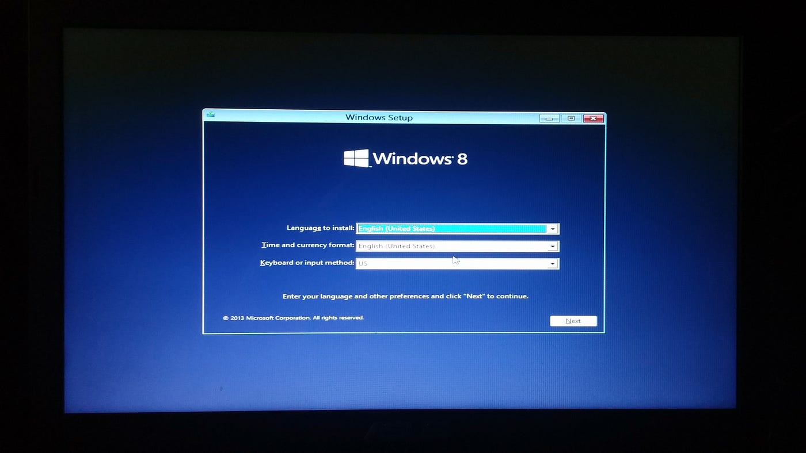

#### Step 7 — Install the OS

All that is left to do is install the operating system\!

That’s all there is to it\! If you have any issues, comment below\. :\) Hope this helped\!


_[Post](https://medium.com/mitchtalmadge/using-serva-to-install-windows-over-your-home-network-2015-07-10-using-serva-to-install-windows-over-your-home-network) converted from Medium by [ZMediumToMarkdown](https://github.com/ZhgChgLi/ZMediumToMarkdown)._
