### How to Modify Android Emojis \(ROOT Required\)

_Edit 5/25/2018: Just a note, this was written many years ago and I have not updated the application much since writing this\. Many things probably do not work anymore\. I don’t have time to fix it\. Sorry\!_

Have you ever wished that you could change the way one or more of the Emojis on your Android looked? Maybe you want a completely custom set of Emojis on your device, or maybe you’re just looking to change the stock Google smileys to the S6 smileys\. Whatever the case, now it’s not only possible, but easy\! In this tutorial, I will walk you through the steps of creating and modifying the Emojis on your Android device\. I will replace the S6 ribbon Emoji on my phone with the OSX/iOS ribbon as an example\. Let’s get started\!

**This tutorial takes place on a Windows PC\. It might not work on OSX/Linux\. \(I haven’t tried it\. \)**
### **Required Items**
- A **ROOTED** Android device running at least _Ice Cream Sandwich_ \. This will not work on a non\-rooted device\.
- A file explorer on your Android capable of modifying system files\. I recommend [_File Explorer_ by _NextApp_](https://play.google.com/store/apps/details?id=nextapp.fx)
- A USB cable to connect your Android to your computer\.

These next steps will walk you through finding the Emoji font on your Android and copying it to your computer\.
### **Step 1 — Locate and Copy the Emoji Font**
1. Open the file explorer on your Android device\.
2. Navigate to the root directory of the device\. \(On File Explorer by NextApp, this is the “System \(Root\)” tile\. \)
3. Navigate to `/system/fonts` \.
4. Find and copy `NotoColorEmoji.ttf` to your clipboard\. `NotoColorEmoji.ttf` is where all the Android Emojis are stored\. _No, this font will not work on your computer\. You cannot use it in Word\. Sorry\._
5. Open your sdcard and paste the file somewhere\. I will put mine in the “Documents” folder\.

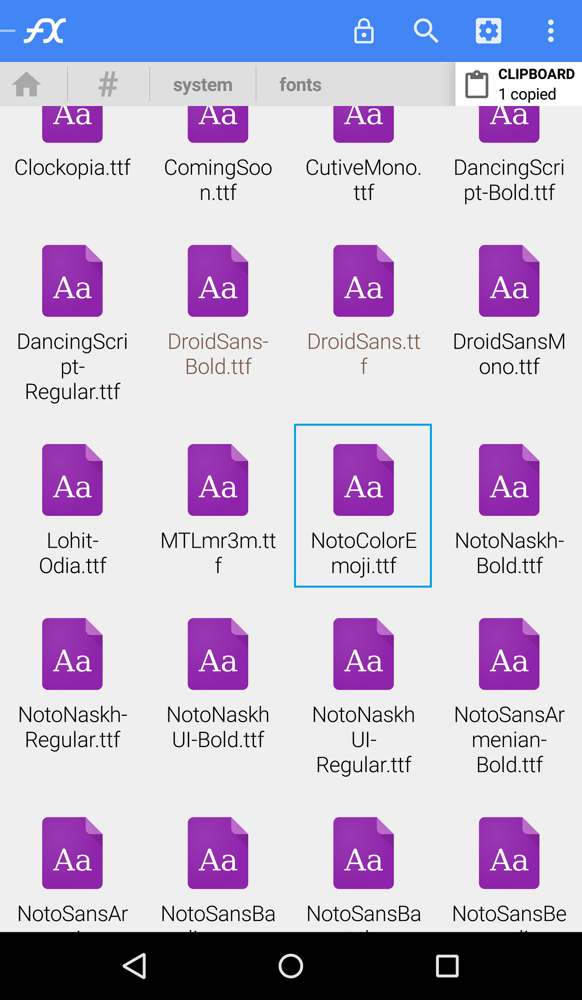

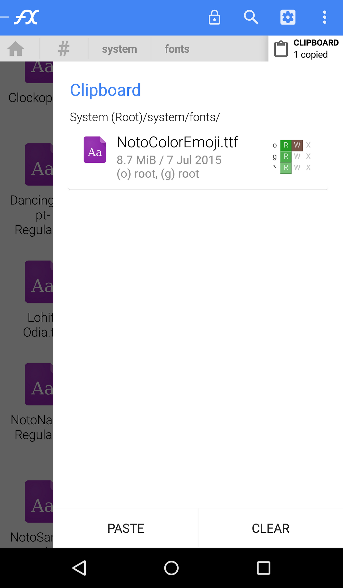

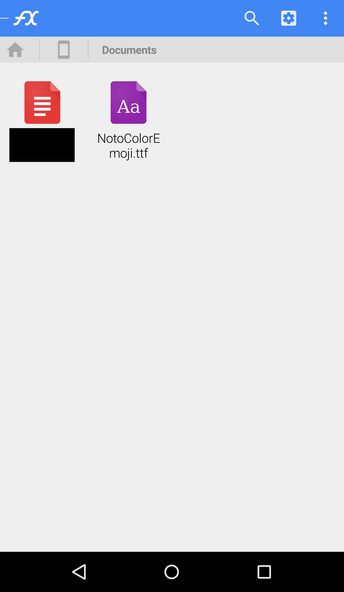

### **Step 2 — Transfer the Emoji Font to your Computer**
1. Plug your Android device into your computer using the USB cable\.
2. Make sure the Android device is in Mass Storage / MTP mode and that you can see the Android device on your computer\.
3. Create a folder on your computer to store all the files for this tutorial\. I will create one in C:Emojis\.
4. Open your Android device on your computer and copy the NotoColorEmoji\.ttf file from your device to the folder we just created\.

**Note: It would be a good idea to make a backup of NotoColorEmoji\.ttf in case something goes wrong or you don’t like your new/modified Emojis\.**

### **Step 3 — Download Emoji Tools**

Next, we will use some tools I created called _Emoji Tools_ to extract the Emojis from the NotoColorEmoji\.ttf file into individual PNG files\.
1. Go to [this page](https://github.com/MitchTalmadge/Emoji-Tools/releases) and download the latest Emoji Tools\. \(V1\.8 at the time of writing\. \) If you are running Windows, download the \.exe file\. For other operating systems, try the \.jar file\.
2. Save the file to the folder we created\.
3. There is no install necessary\. All done\!

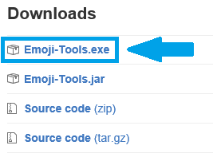

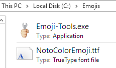

### **Step 4 — Extract the Emojis**
1. Double click on `Emoji-Tools.exe` or `Emoji-Tools.jar` \.
2. Make sure you are on the Extractor tab, then browse to the `NotoColorEmoji.ttf` file\.
3. Do not change any settings\.
4. Click “Start Extraction\.”
5. Let it finish and click “OK\.”
6. Close Emoji Tools\.

There should now be a folder called `ExtractedEmojis` inside of the folder we created\. Inside this folder will be hundreds of PNG files — one for each Emoji\! There will also be a file called `android.ttx` , but don’t modify this file\! It contains important info that allows the Emojis to be re\-packaged into a new font\. Without it, you cannot package your Emojis\!

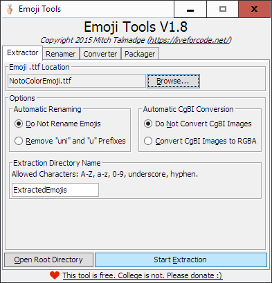

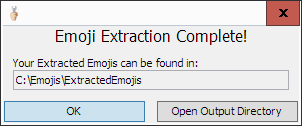

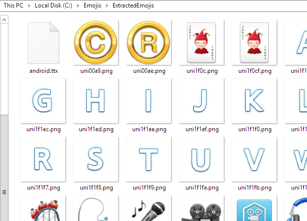

### **Step 5 — Modify the Emojis**

Next, we will modify the Emojis\. There are a few things you can do at this point, and it is up to you what to do:
- You can modify the Emoji png files directly using Photoshop or another image editing program\.
- You can find images online that you would like to use as Emojis\.
- You can extract Emojis from another Emoji Font and use one or more of those Emojis\.

#### **If you want to modify the Emoji png files directly:**
1. Open the Emoji png file\(s\) you want to modify in Photoshop or another image editing program\.
2. Modify to your heart’s content\.
3. Save\. **Make sure the resolution remains the same** and that the file is a png\!

#### **If you want to use an image from online:**
1. Find and save the image\.
2. Open the image in Photoshop or another image editing program\.
3. **Crop/Resize the photo to the same resolution as all the other Emoji png files\.** You can find this by right\-clicking one of the Emojis png files and clicking “Properties,” then clicking the “Details” tab\. Under “Image” will be the Width and Height in pixels\.
4. Save as a png, overwriting one of the old Emojis, using the old Emoji’s name\. You **cannot** “add” an Emoji\. All you can do is replace or modify one of the old ones\.

#### **If you want to use one or more Emojis from another Emoji Font:**
1. Find the Emoji font you want to use\. \(Use Google to find them\. I will be using the OS X Emoji Font\. Microsoft Emoji Fonts are not supported at the time of writing\. \)
2. Extract the Emojis using the same process as in Step 4, but choose a different Extraction Directory Name\! **Important: If you are using an iOS or OS X Emoji Font, you need to select “Convert CgBI Images to RGBA\.”**
3. Click on the “Renamer” tab in Emoji Tools, and browse to the Extraction Directory you’ve just created\.
4. Select “Set Prefix to “uni””
5. Select “Lowercase\.”
6. Click “Start Renaming\.”
7. Let it finish and click “OK\.”
8. Close Emoji Tools\.
9. Open the Emoji png file\(s\) you want to use in an image editor, and **re\-size them to the same size as the Emoji png files you extracted earlier** \. You can find this by right\-clicking one of the Emojis png files you extracted earlier and clicking “Properties,” then clicking the “Details” tab\. Under “Image” will be the Width and Height in pixels\.
10. Overwrite the existing Emoji png file\(s\) that you extracted earlier with the ones you just resized\. They should have the same names\.

> Note: For a quick way to re\-size lots of Emojis at once, check out [http://bulkresizephotos\.com/](http://bulkresizephotos.com/) 

> Even though it’s online, all the re\-sizing happens on your computer and nothing is uploaded, so it’s pretty quick\! \(It took me about a minute for 846 files\) \. Just make sure to choose “Exact Size” when it asks you how to re\-size, and put in the dimensions needed\. Also, **choose the “Pro” settings and make sure the files are PNGs with transparency** \. 

> A zip file will be downloaded containing all of your re\-sized PNGs\. 

**Warning: Be aware of transparency in your Emojis\. If you edit your Emoji in MS Paint, it will not save transparency\! You will end up with an Emoji with a white background\!**

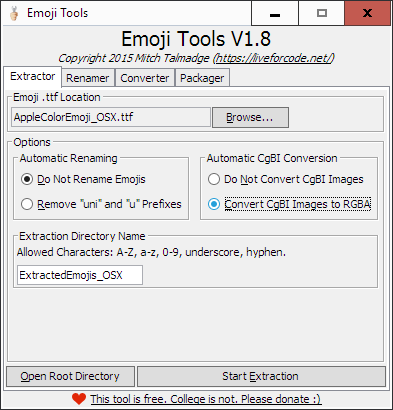

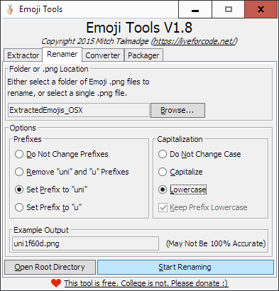

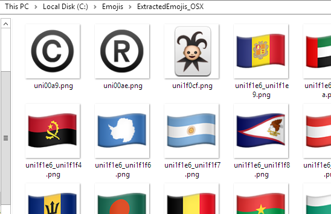

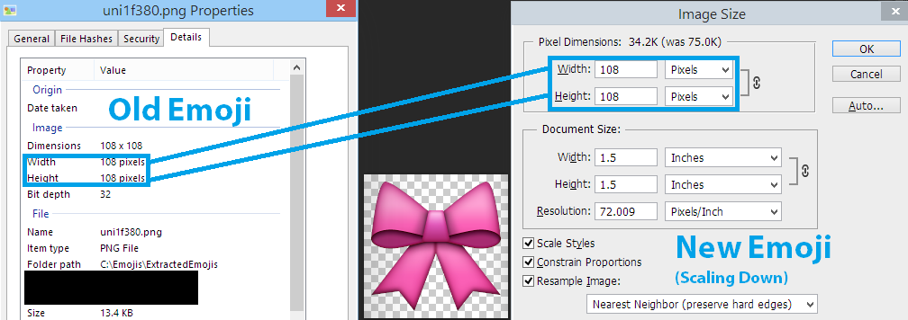

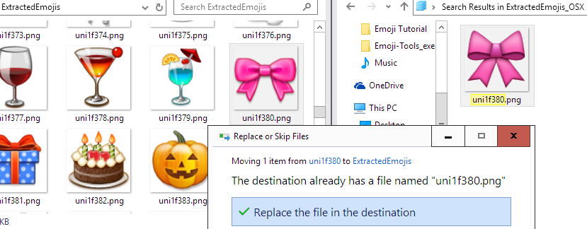

### **Step 6 — Repackage NotoColorEmoji\.ttf**
1. Open Emoji Tools and click on the “Packager” Tab\.
2. Browse to the Android Emoji folder \(mine was called `ExtractedEmojis` \) \.
3. Click “Start Packaging\.” Emoji Tools will automatically build a new `NotoColorEmoji.ttf` font because that is the type of font we used when extracting\.
4. Once it’s finished, click “Open Output Directory\.”
5. Plug your Android device back into your computer \(if you unplugged it\. \)
6. Paste the `NotoColorEmoji.ttf` file into your device’s internal storage, overwriting the old `NotoColorEmoji.ttf` file\.

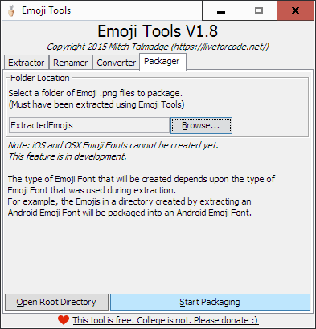

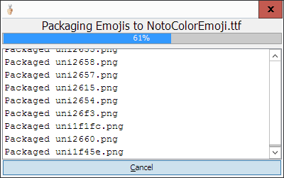

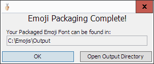

### **Step 7 — Replace NotoColorEmoji\.ttf on your Android device**
1. Open your file explorer on your Android device and copy the `NotoColorEmoji.ttf` from your sdcard to your clipboard\.
2. Navigate to `/system/fonts` again\.
3. This time, you need to make sure you have read/write access to the fonts folder\. The way to do this varies for different apps\. If you are using _File Explorer_ by _NextApp_ , tap the menu icon in the top right of the app and tap “Mount Read\-Write\.”
4. Paste `NotoColorEmoji.ttf` from your clipboard to the fonts folder\. Overwrite the old `NotoColorEmoji.ttf` font when asked\.
5. Restart your Android device\.

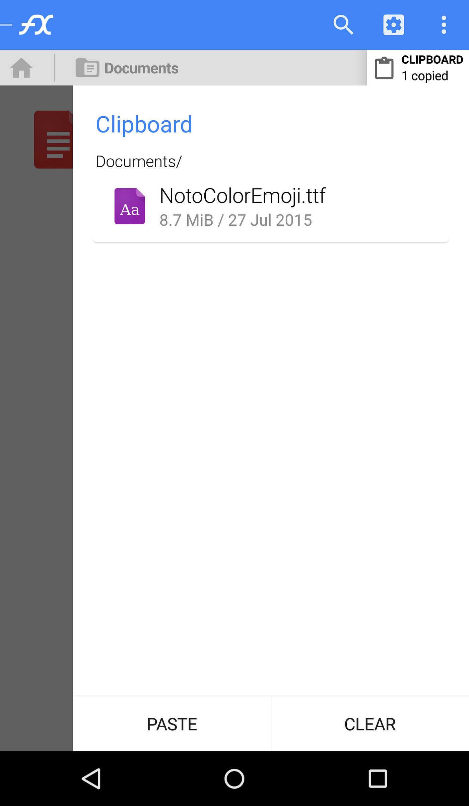

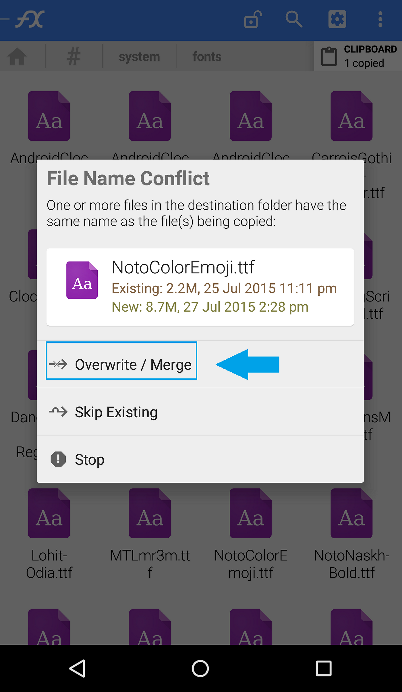

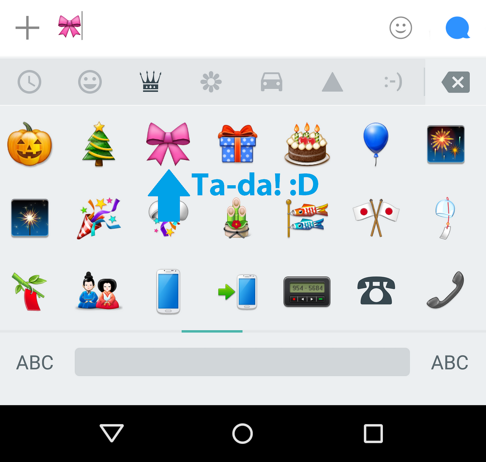

### **Step 8 — Test out your new Emojis**

Open an app you can write in and check to see if your changes worked\! :\)

All done\!

_[Post](https://medium.com/mitchtalmadge/how-to-modify-android-emojis-root-required-2015-07-28-how-to-modify-android-emojis-root-required) converted from Medium by [ZMediumToMarkdown](https://github.com/ZhgChgLi/ZMediumToMarkdown)._
