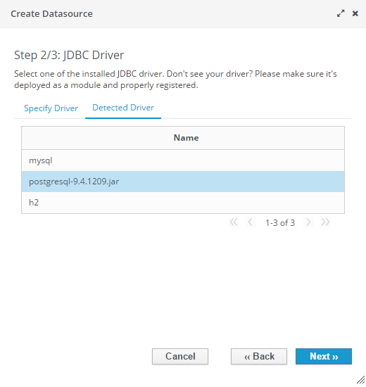

### Install the PostgreSQL JDBC Driver on WildFly 10

Installing and using the PostgreSQL JDBC Driver on WildFly 10 is very easy\! Follow these steps and you’ll be up and running in no time\.
### Step 1: Download the Driver

You can get the PostgreSQL JDBC Driver from [this webpage\.](https://jdbc.postgresql.org/download.html) Make sure to get the latest **JDBC** driver\. In my case, the link said `9.4.1209 JDBC 42` \(But it is probably updated by now\! \)
### Step 2: Deploy the Driver

Move the JDBC driver \.jar file from wherever you saved it into `WILDFLY_INSTALL_DIR/standalone/deployments` \. Start up your WildFly server, and the jar will deploy\. At this point you might be thinking: “Wait, I thought only \.war and \.ear files could be deployed\!” Nope\! It works for JDBC drivers too :\)
### Step 3: Use the Driver\!

Now when you create a datasource, make sure that when it comes time to select a driver, you choose “Detected Driver” and select the PostgreSQL jar file you deployed in step 2\.

All done\! :D

