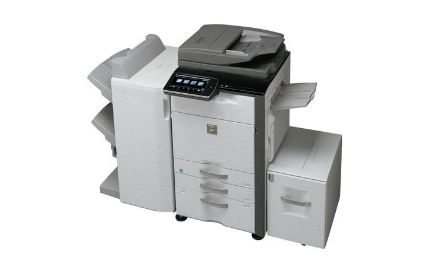
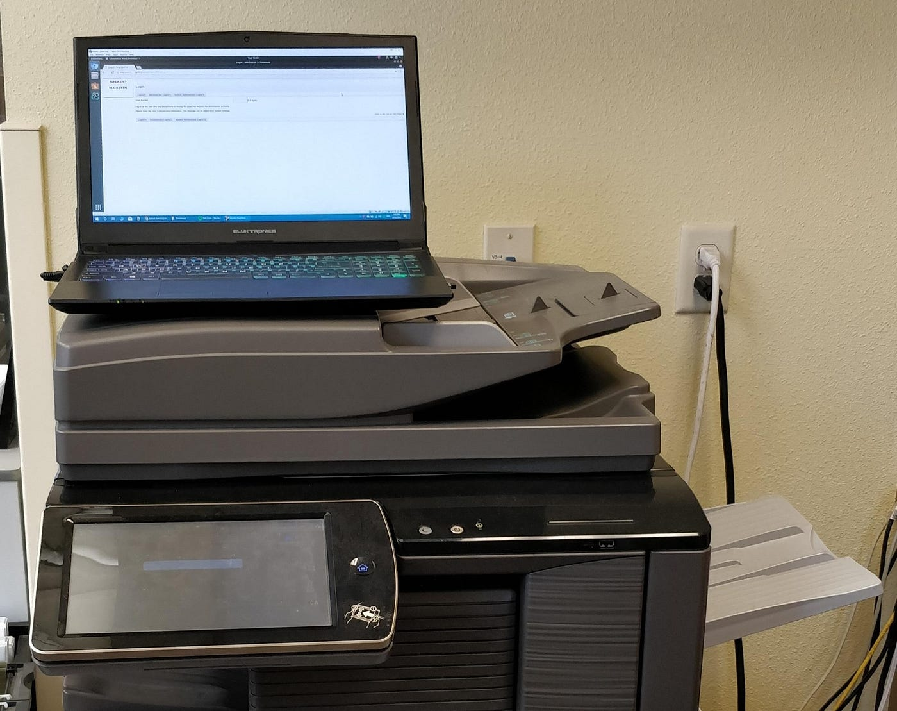
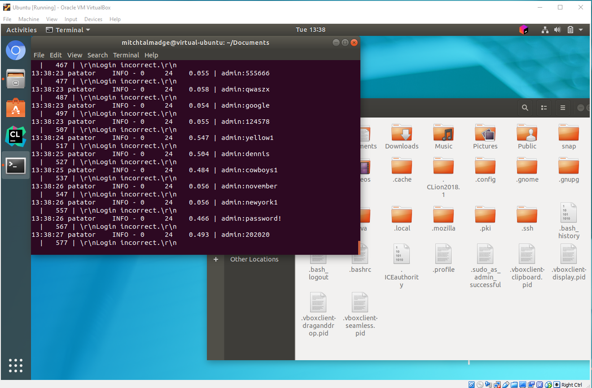

### Hacking Into a SHARP MX Copier

In my spare time, I do web and IT work for a local school\. In the main office, there is a SHARP MX\-5141 copier which has used the default admin password for as long as it has been installed\. Recently, someone changed the password and didn’t tell anyone\. We needed into the admin settings, but every password we tried did not work\. To make matters worse, the copier company would have taken three days to come out and perform a factory reset\.

I took this opportunity to try and hack my way into the printer\. Hardware like this are notorious for having security vulnerabilities, so I figured I might have some hope\. Some searching across Google did not yield me any answers, and I was on my own\.
#### Communicating with the Printer

The first step was to find a way to talk to the printer via my computer, since the built\-in display was far too limited\. Almost every copier of this size has a web interface that can be accessed on port 80\. Through Windows’ printer scanner, I was able to find the printer on the network\. However, I kept getting connection refused errors when trying to connect\.

I used **nmap** to scan the most common ports of the printer, but again, nothing was getting through\. I chalked it up to the school’s firewall, and decided to use alternative methods\.

The printer is hardwired into the school’s network via an ethernet cable\. I plugged this cable into my own laptop and set up an ad\-hoc network\. Then I was able to access all open ports on the printer, including the web interface\! Success :\)
#### The Web Interface

This copier has two built\-in admin accounts: “admin” and “sysadmin”\. The default passwords for these accounts are the same as their usernames\. The sysadmin account can only be accessed from the web interface, which meant that the password was unchanged\. I was able to login as sysadmin, however I was not allowed to change the admin password from this account\. Technically, for our needs, I could have stopped here\. However, I am not satisfied with “good enough\.” If I couldn’t change the password, maybe I could guess it\.

As the sysadmin, I was able to open and close ports at will\. I found the telnet port to be disabled, and I opened it up\.
#### Telnet Dictionary Attack

Now that I had access to telnet, I had a way to bruteforce the admin password without rate limiting\. I used **patator** on an Ubuntu virtual machine to try the 10,000 most common passwords\. Unfortunately, this did not yield any results\. None of the passwords worked\. I was tired of waiting around, so I came up with a new idea\.
#### Return to The Web Interface

For some reason, there seems to be a trend of not validating user input in embedded software, especially among Asian companies like SHARP\. With this in mind, I decided to try changing the password via an HTTP POST request\. I first opened the Chrome debugger and enabled network logging\. Then, I changed my own password as sysadmin\. Copying the request format, I changed the ID of the user from the sysadmin to the admin\.

Lo and behold, it worked\! \! The admin password was changed by an account which did not have the privileges to do so, because the backend web framework did not include user form validation\. A rookie mistake\.

I was unable to repeat the attack when signed in as a standard user, but I have a feeling most people forget to change the sysadmin password anyway\.

