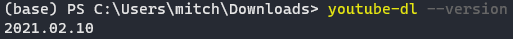
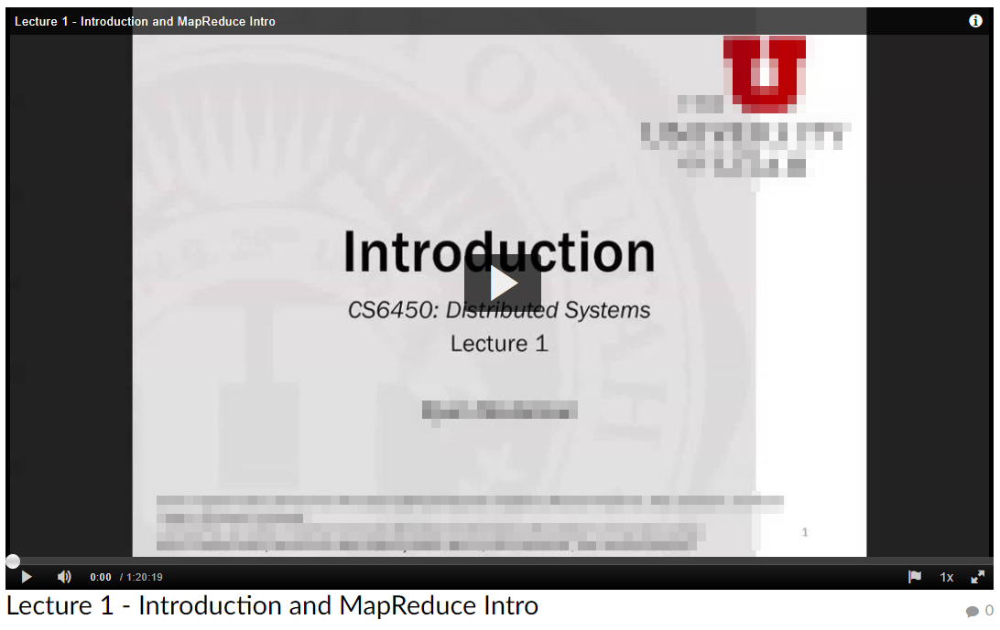
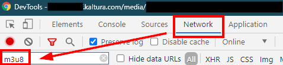
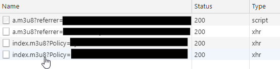
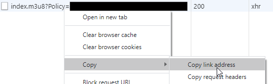

### How to Download Videos from Canvas

If you are like me, then you are a student who prefers watching video lectures on your TV than on the embedded video player within Canvas\. Unfortunately, there is no Canvas app for my Android TV\. However, there is the PLEX media client, where I can watch any video files from my computer’s hard drive\. The problem is that the Kaltura\-based videos that most professors use on Canvas have no download button\. This is likely to stop people from downloading and distributing lectures that they paid for, but honestly I think it does more harm than good\.

In this article, I will show you how to use a tool called **youtube\-dl** to download these videos to your hard drive as `mp4` files, which you can then stream to your TV or play on your phone or whatever else you’d like\. Despite the fact that “youtube” is in the name, this tool is meant for all kinds of video websites, and we can make it work for Canvas\.

_Disclaimer: This process may be in breach of Canvas and/or Kaltura’s TOS, so do this at your own risk\. I assume no responsibility for you following these instructions\. You should not distribute any videos you may download with this method\._
### 1: Install **youtube\-dl**

First things first, go to [https://github\.com/ytdl\-org/youtube\-dl/releases](https://github.com/ytdl-org/youtube-dl/releases) to get **youtube\-dl** \. On Windows, download the `youtube-dl.exe` file and place it somewhere easy to find\. On Mac, get the `youtube-dl` file and do the same\. **This is a command\-line program\. Don’t double\-click it and expect something to show up\.**

Next, open a command prompt or terminal and navigate to the place where you put the file you just downloaded\. If you don’t know how to use the terminal, please either watch [this Windows Tutorial](https://www.youtube.com/watch?v=MBBWVgE0ewk) or [this Mac Tutorial](https://www.youtube.com/watch?v=aKRYQsKR46I) \.

Once you are in the directory, type `youtube-dl --version` and hit enter\. Make sure it prints something out like `2021.02.10` \(this value will depend on your actual version of course\) \. If you see this, then **youtube\-dl** is ready to go\.




Example
### 2: Find the video URL

**youtube\-dl** expects the URL of a video to download\. Unfortunately you cannot just grab the URL of the page with the video _on_ it and be done\. It’s a bit more involved than that\.

First, find open the video you want to download from Canvas\. I’m using Google Chrome for this, and I suggest you do too or the steps may differ\. However, any browser should work if you know what you are doing\.

The Kaltura videos we want to download will usually be in the “Media Gallery\.” Open just one of them, and **do not hit play\.** It will look something like this:





Next, press F12 to open the browser developer tools\. Open the “Network” tab and type “m3u8” into the filter box:





Now you can hit play\. Pause the video after a few seconds and come back to this window\. You will see a few entries; you want the last of the ones which say “index\.m3u8”: \(This should be the highest quality version\. \)





Right click on it and copy the link address:




### 3: Initiate the Download

Now, open the terminal back up and enter the following command:
```
youtube-dl "PASTE URL HERE" -o DESIRED_NAME.mp4
```

Paste the URL inside the quotation marks as shown, and choose the name of the output file\. Here’s an example with many parts of the URL stripped out:
```
youtube-dl "https://...kaltura.com/.../index.m3u8..." -o Lecture1.mp4
```

Now hit enter\. The file will begin downloading and will be stored in the same place that `youtube-dl` resides\. Once it is done, you should have an mp4 file ready to play\!

Now just repeat steps 2 and 3 for as many videos as you’d like to download\. It’s tedious but in my opinion it’s worth the effort\. Hope this helps you\! The next step might be to save these to your phone’s internal memory to watch them offline on\-the\-go, or put them on a PLEX server so you can watch them from your smart TV\. It’s all up to you from here\.


